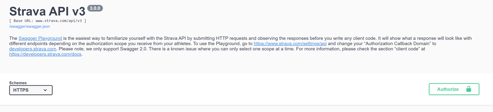
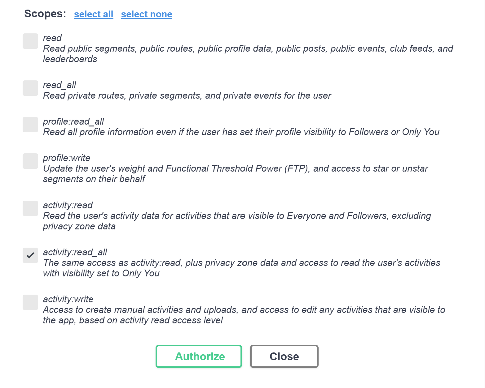
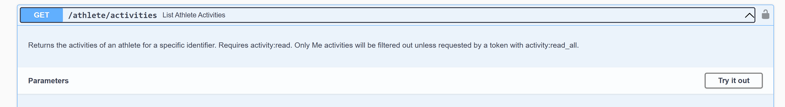
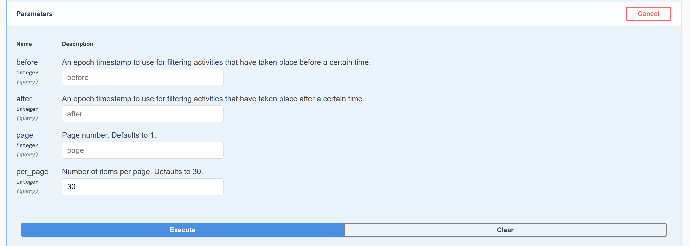
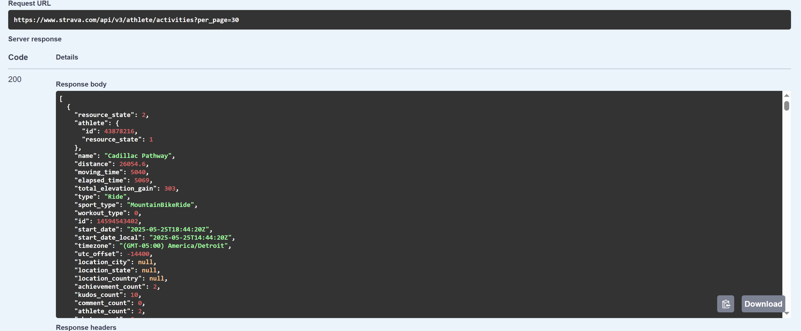

This is a repo where I do a deep dive into a variety of my Strava data files, looking into different metrics and creating different visualizations

## Activities Scraping Directions
### Manual JSON Requests through Strava Playground
To manually your activities from a specified timeframe, execute the following steps.

#### 1: Navigate to the Strava Playground Website
Via browser, access the Strava API v3 Playground [here](https://developers.strava.com/playground/)

#### 2: Give Access to your Profile
Select the "Authorize" button on the right side of the screen 

Select "activity:read_all" and "Authorize" 

Confirm authorization from your profile 

#### 3: Execute the API Call

Scroll down in the playground and select "Get /athlete/activities" and click "Try it out" 

Fill in the parameters desired for the API call 

Download the API Response and store in the "activities_data" folder 

