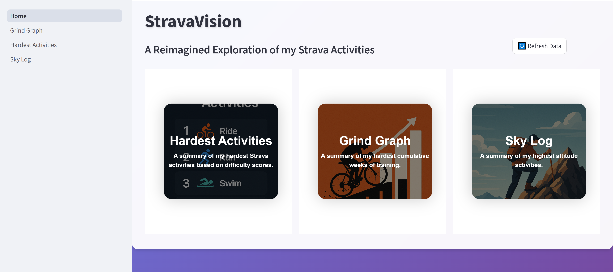

# StravaVision
StravaVision is a repository and Streamlit-based app where I do a deep dive into a variety of my Strava activities, looking into different metrics and creating different visualizations.

<div align="center">
  
  <p><em>StravaVision App Homepage</em></p>
</div>

## Repository Structure
```markdown
├── pages/                                    # Folder containing the python scripts for each page of the app
│   ├── Hardest_Activities.py                   # Python script for the page containing the tabular visualization of my hardest activities
│   ├── Grind_Graph.py                          # Python script for the page containing the tabular visualization of the hardest cumulative weeks
│   └── Sky_Log.py                              # Python script for the page containing the tabular visualization of the highest altitudes
├── Home.py                                   # The main python wrapper for the app
├── utils.py                                  # Python script containing a variety of helper functions used throughout the application
├── config.py                                 # Python script containing the logic for loading the API tokens into the environment
├── styles.py                                 # Python script containing the CSS styling for the app
├── README.md                                 # README for the repo
└── .gitignore                                # git ignore for the repo
```

## Acknowledgments

